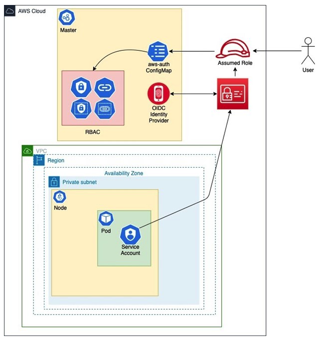

# Terraform module for EKS onboarding resources


Terraform Module will deploy some resources for EKS cluster onboarding. This module does not provide a new EKS cluster, but can add new resources to an existing EKS cluster.

In the other hand provide outputs to validate current state of the cluster.

Main Terraform providers used are: 

* [Provider: hashicorp/aws](https://registry.terraform.io/providers/hashicorp/aws/latest)
* [Provider: hashicorp/kubernetes](https://registry.terraform.io/providers/hashicorp/kubernetes/latest)

Module was initially defined to create IAM role mapping for Kubernetes users and your cluster workload service accounts with Terraform. On boarding process will be extended with new features.



&nbsp;

## Changelog

See changelog control version [here](CHANGELOG.md)

&nbsp;
### Constraints

To use this module is required use following considerations:

- Terraform version 1.3 or higher to accept variables type `list(object({}))`
- aws-cli tested 2.9.17 to prevent errors of kubernetes API `client.authentication.k8s.io/v1`
- kubectl client tested 1.23.5 and support for >= 1.24

&nbsp;


## Team settings Payload: allowed team definition

*IMPORTANT:* This new feature does not break previous compatibility.


Variable `team_settings` allow customize team settings on the fly. Idea is allow terraform execution to mapping IAM roles definitions, ECR repository names, SSO names or whatever additional required parameters required to configure based on each team definitinon. 


When the variable `team_settings` is not defined will take default value `[]`. Default value allows the module to setup predefined values for some other parameters based on `namespace` and `stage` selected like:

- ecr_repository_tag_team
- github_repositories
- kms_clusters
- route53_hostedzone

For example, with these values:
-  `namespace=team-blog`
-  `stage=staging`
-  `team_settings=[]`  

Settings predefined will be:

```hcl
team_mapping = {
  "team_mapping" = {
    "ecr_repository_tag_team" = "blog"
    "eks_cluster" = {
      "hostedzone" = "Z735WTNG1JTY0"
      "kms" = "f2d03108-d5ad-4db7-8b3d-2de72e3cdca0"
      "name" = "capterra-staging-eks"
    }
    "github_repository" = ["capterra/blog-ui"]
    "namespace" = "team-blog"
    "stage" = "staging"
  }
}
```


### How to invoke team Payload

All elements from the object are optional so you can include whatever number of defined values or omit definition.

If some of the values are not defined, will take default values based on `namespace` and `stage` selected. 

If is required add new object values not listed by default, is required to define new variable object structure within the module. 

- Current list of object variable schema:

```hcl
variable "namespace_mapping" {
  type = list(object({
    ecr_repository    = optional(string)
    github_repository = optional(list(string))
    eks_cluster = optional(object({
      kms        = optional(string)
      hostedzone = optional(string)
    }), {})
  }))
  description = "Define namespace and environment parameteters"
  default     = []
}
```

- Example of module calling with `team_settings` payload from object definition
```hcl
module "eks_onboarding_staging" {
  source = "git@github.com:capterra/terraform.git//modules/eks-onboarding"

  region       = var.region
  namespace    = var.namespace
  eks_name     = var.eks_name
  eks_iam_role = var.eks_cluster_iam_role_arn
  stage        = var.stage
  vertical     = var.vertical

  iam_deployer_role = var.iam_deployer_role_arn
  eks_deployer_role = var.eks_deployer_role_arn

  tags = module.tags_resource_module.tags
  bootstrap = var.bootstrap

  namespace_mapping = var.team_settings
}
```

- Example of module calling with `team_settings` payload from variable
```
terragrunt plan -var 'team_settings=[{ecr_repository="variable-setting",github_repository=["variable-setting"]}]'
```

- Example of module calling with `team_settings` payload from file values (team_settings.auto.tfvars) 
```json
team_settings = [
  {
    github_repository = ["file-setting"]
    ecr_repository    = "file-setting"
    eks_cluster = { 
            kms        = "123456"
            hostedzone = "DUMMY-ZONE"
    }
  }
]
```
### Support multi objects: [{object1},{object2},...,{objectN}]

Now is supported multiple list of objects. One team will be processed each running, but allowing multiple github repositories as source. 

- two objects example:
variable input:
```json
team_settings = [
  {
    github_repository = ["capterra/repository01"],
    ecr_repository    = "repo01"
  },
  {
    github_repository = ["capterra/repository02"],
    ecr_repository    = "repo02"
  }
]
```

terraform outputs:
```hcl
team_mapping      = {
      + team_mapping = {
          + ecr_repository_tag_team = "myecr"
          + eks_cluster             = {
              + hostedzone = "Z735WTNG1JTY0"
              + kms        = "f2d03108-d5ad-4db7-8b3d-2de72e3cdca0"
              + name       = "capterra-staging-eks"
            }
          + github_repository       = [
              + "capterra/repo01",
              + "capterra/repo02",
            ]
          + namespace               = "myteam"
          + stage                   = "staging"
        }
    }
```

&nbsp;

## Bootstrap deploy: Allow diferent deployment behaviour

*IMPORTANT:* This new feature does not break previous compatibility.

Variable `bootstrap` allow set your initial deployment (value `true`) or configure update existing resources (value `false`). 

For now only is used to update IAM Role Principal over Trusted Policy for Deployer Roles. 

  - When a role is created for the first time and the trusted policy has a ARN permission related to himself, the error happens. If the role already exist and is added trusted policy with an ARN permission related to himself, then is updated fine.

[AWS JSON policy elements: Principal](https://docs.aws.amazon.com/IAM/latest/UserGuide/reference_policies_elements_principal.html)

- If your Principal element in a role trust policy contains an ARN that points to a specific IAM role, then that ARN is transformed to the role's unique principal ID when the policy is saved.

&nbsp;

## What this module will do?
* Create AWS IAM group and IAM group policies in `landing account`
* Attach AWS IAM group within policies in `landing account`
* Create AWS IAM roles in `main account`
* Import settings from existing EKS cluster in `main account`
* Create k8s namespace inside the EKS cluster in `main account`
* Create k8s roles and users inside EKS cluster in `main account`
* Create k8s role binding between EKS Role & EKS User in `main account`
* Mapping AWS Roles with EKS users within ConfigMap in `main account`
* Setup custom team settings resources in `main account`


- Related to IAM group with policies attached, there are two policies 
  1. Policy for binding IAM group (`landing account`) with IAM Role (`main account`) using STS Assume Role
  2. Policy for grant EKS Read Only access (`main account`)

&nbsp;

### Inputs from module:

The variables that are passed to module internally. These can be overwritten when calling module from outside. These are:

|Module Parameter|Type|Required|Default Value|Valid Values|Description|
|-|-|-|-|-|-
|region|string|YES|`null`|`AWS values`|AWS region for `main account` where new services is going to be deployed
|region_landing|string|NO|`eu-east-1`|`AWS values`|AWS region for `landing account` where onboarding services are hosted. Default account ID: 237884149494
|namespace|string|YES|`null`|`any`|Name of k8s namespace to create and use to create new k8s resources
|eks_name|string|YES|`null`|`any`|Name of existing EKS cluster to use
|eks_iam_role|string|YES|`null`|`any`|Name of primary IAM role to use for EKS cluster
|stage|string|YES|`null`|`["dev"/"prod"/"staging"/"sandbox"]`|Stage this resource belongs
|vertical|string|YES|capterra|`["capterra"/"getapp"/ "softwareadvice"]`|Vertical this resource belongs to (capterra/getapp/softwareadvice)
|iam_deployer_role|string|YES|`null`|`regex("^arn:aws:iam::[[:digit:]]{12}:role/.+")`| AWS Role to assume with Admin access in order to deploy AWS components (IAM groups, IAM Roles, etc)
|eks_deployer_role|string|YES|`null`|`regex("^arn:aws:iam::[[:digit:]]{12}:role/.+")`| AWS Role to assume with EKS Admin access in order to deploy k8s components (k8s namespaces, k8s RoleBindings, etc)
|team_settings|object|NO|`[]`|`[{object1}]`| Definition of team resources created
|bootstrap|bool|NO|`true`|`["true"/"false"]`| Configure for Initial deployment (bootstrap)


&nbsp;

### Outputs from module: 
Below outputs can be exported from module:

- `eks_info` &nbsp;&nbsp;&nbsp;&nbsp;&nbsp;&nbsp; - Kubernetes Cluster Info
- `eks_namespaces` &nbsp; - Get EKS Namespaces
- `eks_roles` &nbsp;&nbsp;&nbsp;&nbsp;&nbsp;&nbsp; - Get EKS Cluster Roles medatadata
- `eks_users` &nbsp;&nbsp;&nbsp;&nbsp;&nbsp;&nbsp; - Get EKS Cluster user medatada
- `eks_bindings` &nbsp;&nbsp;&nbsp;&nbsp;&nbsp;&nbsp; - Get EKS Cluster Bindings medatada
- `eks_configmaps` &nbsp;&nbsp; - Get EKS Cluster ConfigMaps ID

- `iam_roles` &nbsp;&nbsp;&nbsp;&nbsp;&nbsp;&nbsp; - Kubernetes Cluster Info
- `iam_groups` &nbsp;&nbsp;&nbsp;&nbsp; - The ID of the ElastiCache Replication Group.
- `eks_roles` &nbsp;&nbsp;&nbsp;&nbsp;&nbsp;&nbsp; - The address of the replication group configuration endpoint when cluster mode is enabled.

&nbsp;

## Sections to be added to module caller's main.tf, variables.tf, and output.tf below:


#### Include Below section to caller's provider.tf
```
provider "aws" {
  region = var.region
  assume_role {
    role_arn = var.iam_deployer_role_arn
  }
  default_tags {
    tags = module.tags_resource_module.tags
  }
}
```

#### Include Below section to caller's main.tf
```
module "eks_onboarding_staging" {
  source = "git::https://github.com/capterra/terraform.git//modules/eks-onboarding"

  region    = var.region
  namespace = var.namespace
  eks_name  = var.eks_name
  eks_iam_role      = var.eks_cluster_iam_role_arn
  stage             = var.stage
  vertical          = var.vertical
  
  iam_deployer_role = var.iam_deployer_role_arn
  eks_deployer_role = var.eks_deployer_role_arn

  tags              = module.tags_resource_module.tags
  bootstrap         = var.bootstrap
  namespace_mapping = var.team_settings
}

module "tags_resource_module" {
  source = "git::https://github.com/capterra/terraform.git//modules/tagging-resource-module"

  application         = var.application
  app_component       = var.app_component
  function            = var.function
  business_unit       = var.business_unit
  app_environment     = var.environment
  app_contacts        = var.app_contacts
  created_by          = var.created_by
  system_risk_class   = var.system_risk_class
  region              = var.region
  network_environment = var.environment
  monitoring          = var.monitoring
  terraform_managed   = var.terraform_managed
  vertical            = var.vertical
  product             = var.product
  environment         = var.environment
}
```

#### Optional: Include Below section to caller's outputs.tf
```
# EKS Outputs
################################################################

output "eks_info" {
  description = "Kubernetes Cluster Info"
  value       = module.eks_onboarding_sandbox.eks_info
}
output "eks_namespaces" {
  description = "Get EKS Namespaces"
  value       = module.eks_onboarding_sandbox.eks_namespaces
}

output "eks_roles" {
  description = "Get EKS Cluster Roles medatadata"
  value       = module.eks_onboarding_sandbox.eks_roles
}

output "eks_users" {
  description = "Get EKS Cluster user medatada"
  value       = module.eks_onboarding_sandbox.eks_users
}

output "eks_bindings" {
  description = "Get EKS Cluster Bindings medatada"
  value       = module.eks_onboarding_sandbox.eks_bindings
}

output "eks_configmaps" {
  description = "Get EKS Cluster ConfigMaps ID"
  value       = module.eks_onboarding_sandbox.eks_configmaps
}


# IAM Outputs
################################################################
output "iam_roles" {
  description = "Get AWS IAM Roles"
  value       = module.eks_onboarding_sandbox.iam_roles
}

output "iam_groups" {
  description = "Get AWS IAM Groups"
  value       = module.eks_onboarding_sandbox.iam_groups
}
```

&nbsp;
## Usage:

When making use of this module:

  1. Init your backend and providers
    
    aws-vault exec default -- terragrunt init
    
  2. Plan (using --no-session)

    aws-vault exec default --no-session -- terragrunt plan -out "your_plan_name.tfplan"
    
  3. Apply (using --no-session)
    
    aws-vault exec default --no-session -- terragrunt apply "your_plan_name.tfplan"
    

&nbsp;
## Results:

After deploy all components, if everything is succesfull you can get the outputs

```
aws-vault exec default -- terragrunt output
```

An example of output could be the following. Based on your environment settings (namespace, stage, etc), the output will be different. 


```
Outputs:

eks_bindings = [
  "team-crf-admin-role-binding",
  "team-crf-ro-role-binding",
  "team-crf-basicuser-role-binding",
  "team-crf-deployer-role-binding",
]
eks_info = {
  "eks_info" = {
    "arn" = "arn:aws:eks:us-east-1:176540105868:cluster/capterra-staging-eks"
    "endpoint" = "https://25A06630668756A639F64BB6A74AA760.gr7.us-east-1.eks.amazonaws.com"
    "id" = "capterra-staging-eks"
    "platform_version" = "eks.8"
    "role_arn" = "arn:aws:iam::176540105868:role/eksctl-capterra-staging-eks-cluster-ServiceRole-8JFK3L91VQ5E"
    "version" = "1.25"
  }
}
eks_namespaces = tolist([
  "team-awesome",
  "team-blog",
  "team-crf",
  ..
])
eks_role_deployer_user_arn = "arn:aws:iam::176540105868:role/assume-eks-team-crf-staging-deployer"
eks_roles = [
  "team-crf-admin-role",
  "team-crf-ro-role",
  "team-crf-basicuser-role",
  "team-crf-deployer-role",
]
eks_users = [
  "team-crf-staging-admin-user",
  "team-crf-staging-ro-user",
  "team-crf-staging-basicuser",
  "team-crf-staging-deployer-user",
]
iam_roles = [
  "arn:aws:iam::176540105868:role/assume-eks-team-crf-staging-deployer",
]
team_mapping = {
  "team_mapping" = {
    "ecr_repository_tag_team" = "crf"
    "eks_cluster" = {
      "hostedzone" = "Z735WTNG1JTY0"
      "kms" = "f2d03108-d5ad-4db7-8b3d-2de72e3cdca0"
      "name" = "capterra-staging-eks"
    }
    "github_repository" = [
      "gartner-digital-markets/cx-review-*",
    ]
    "namespace" = "team-crf"
    "stage" = "staging"
  }
}
```

&nbsp;
## Test ConfigMap:

You can validate if your ConfigMap is working by using the following command:

1. Export your variables
    ```
    export namespace=team-blog
    export stage=sandbox
    export eks_name=sandbox-eks-test
    export aws_region=us-west-2
    ```
2. Run you script   

    ```
    scripts/test_ConfigMap_capterra.sh

    === Alias for aws-vault (account: capterra-sandbox-admin)
    Updated context arn:aws:eks:us-west-2:944864126557:cluster/sandbox-eks-test in /Users/daoliva/.kube/config
    Switched to context "arn:aws:eks:us-west-2:944864126557:cluster/sandbox-eks-test".

    Run ConfigMap validation
    ------------------------------
    === NAMESPACE: team-blog ===
    === USER: team-blog-sandbox-admin-user ===
    -- create --
    Resource pods: yes
    Resource deployments: yes
    -- delete --
    Resource pods: yes
    Resource deployments: yes
    -- get --
    Resource pods: yes
    Resource deployments: yes
    -- list --
    Resource pods: yes
    Resource deployments: yes
    -- patch --
    Resource pods: yes
    Resource deployments: yes
    -- update --
    Resource pods: yes
    Resource deployments: yes
    -- watch --
    Resource pods: yes
    Resource deployments: yes
    ```
