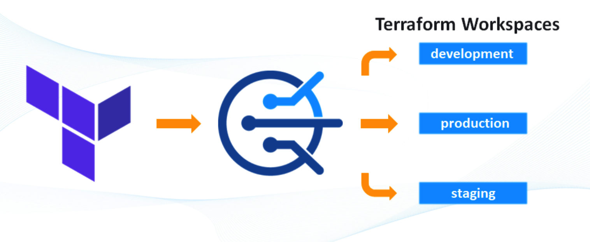
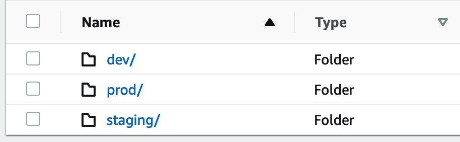

# Project folder

##  What's the purpose

Using terraform workspaces all code is integrated in a single stack, reducing human mistake and coding time with only single stack folder. All new customizations will be applied based on Terraform Workpaces over isolated S3 backend states. 



Best practices follows  architectural pattern form multiples organizations.

[Multi-account AWS Architecture](https://developer.hashicorp.com/terraform/language/settings/backends/s3#multi-account-aws-architecture)

Latest terraform workspace documentation:

[Terraform Workspaces](https://developer.hashicorp.com/terraform/language/state/workspaces)


&nbsp;
## Terragrunt enhacements

In addition, wrapper of Terragrunt allows some hooks validations and withelist workspaces allowed: `["dev"|"staging"|"prod"]`

By default, terraform automatically set backend location when is used non `default` workspace over the root S3 folder `env:/`  


[S3 Backend state](https://developer.hashicorp.com/terraform/language/settings/backends/s3#multi-account-aws-architecture)


With terragrunt we can customize S3 backend allocation structure when workspace is in use. When default workspace is in use, S3 state file will be set as usual. 




&nbsp;
## How to integrate

- First define manually all required workspaces from self hosted. Already done in this STATE:

```
terraform workspace new dev
terraform workspace new staging
terraform workspace new prod
```

- And select your desired workspace framework. Always running workspace commands by `terraform` (not by `terragrunt`!)

```
terraform workspace select dev
Switched to workspace "dev".

terraform workspace list      
  default
* dev
  prod
  staging
```
&nbsp;
## Working with workspaces

In the workflow variable `ACTIVE_ENV` set also environment variable `TF_WORKSPACE` used by Terraform.

[Selecting a workspace when running Terraform in automation](https://support.hashicorp.com/hc/en-us/articles/360043550953-Selecting-a-workspace-when-running-Terraform-in-automation)

This variable `TF_WORKSPACE` set active workspace and force system to exclusive work with this workspace:

* Example: 
```
export TF_WORKSPACE=staging
terraform workspace select dev

The selected workspace is currently overridden using the TF_WORKSPACE
environment variable.

To select a new workspace, either update this environment variable or unset
it and then run this command again.

terraform workspace show      
staging

```

## Terragrunt hooks

Terragrunt hooks allows whitelist selection of workflows exclusive for environments: `["dev"|"staging"|"prod"]` when some special terragrunt commands are executed:

**special commmands: only allowed for whitelisted workspaces**

<sup>terragrunt ["plan","apply","validate"]</sup>

**non special commands: valid for all workpaces active**

<sup>terragrunt ["init","refresh","providers"...]</sup>

&nbsp;

* Example of non special commands working for all workspaces active:
```
terraform workspace show          
default

terragrunt init
default

Initializing the backend...

Successfully configured the backend "s3"! Terraform will automatically
use this backend unless the backend configuration changes.
Initializing modules...
..
..
```


* Example of special commands with not whitelisted workspaces enviorments (`["dev"|"staging"|"prod"]`)
```
terraform workspace show
default

terragrunt validate
default
INFO[0001] Executing hook: workpace_validation          
ERRO[0001] Error running hook workpace_validation with message: exit status 1 
ERRO[0001] Errors encountered running before_hooks. Not running 'terraform'. 
INFO[0001] Executing hook: workpace_error               
=== Error: Invalid Workspace selected: default
ERRO[0001] 1 error occurred:
        * exit status 1
          
echo $?            
1
```

In the previous example, default workspace `default` will be rejected when some terragrunt commands are run and workflows will be stoped when found and error (```exit code 1```)

* Example of special commands with a whitelisted workspaces enviorments (`["dev"|"staging"|"prod"]`)
```
terraform workspace show
staging

terragrunt validate
staging
INFO[0001] Executing hook: workpace_validation          
=== Workspace active: staging
Success! The configuration is valid.

INFO[0004] Executing hook: workpace_error 
```

&nbsp;